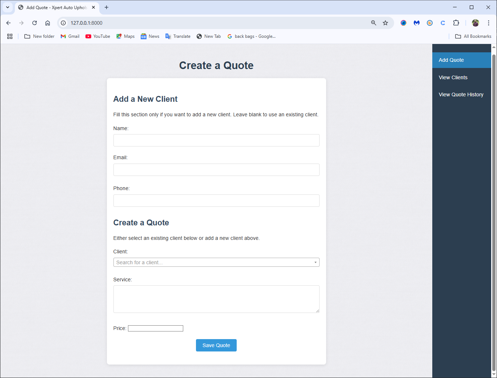
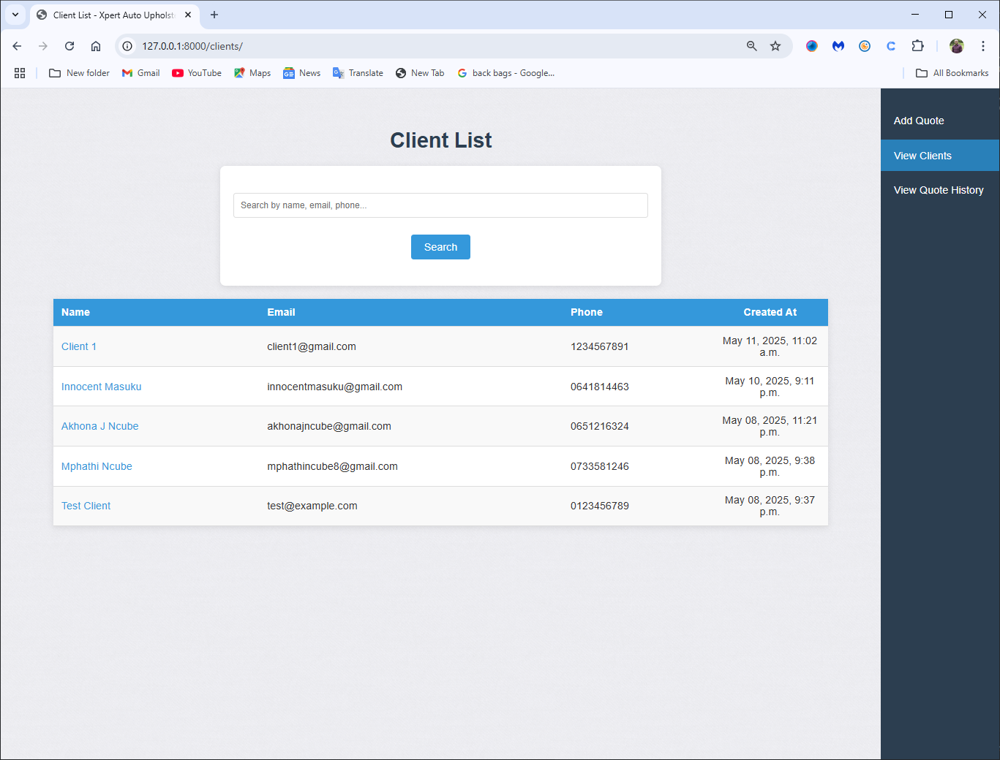
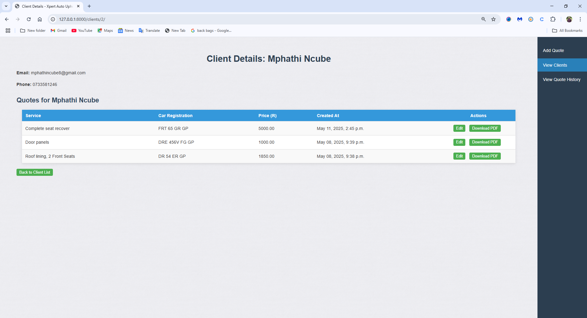
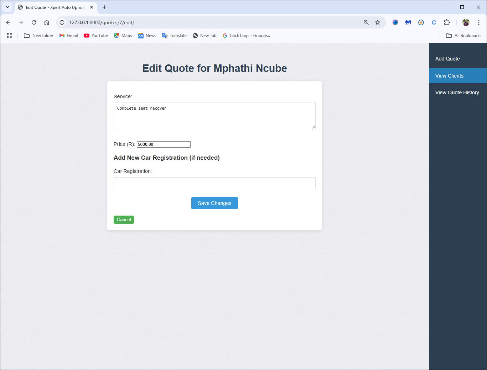
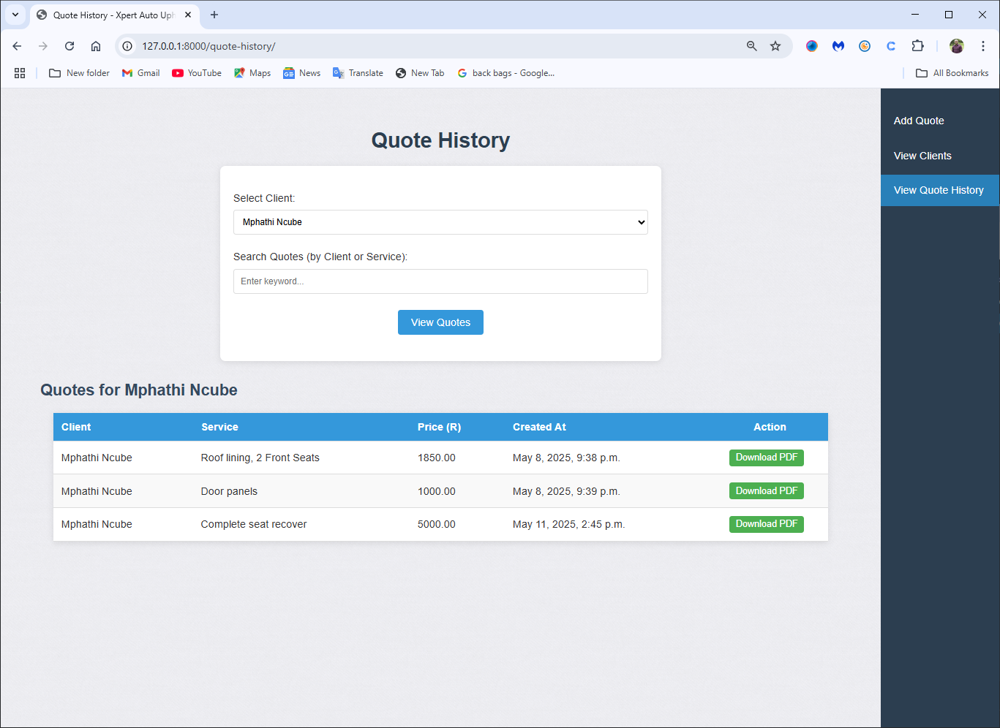

# Xpert Auto Upholstery - Quote Management System

A Django-based web application built to help Xpert Auto Upholstery manage clients, car registrations, and generate professional quotes.

---

## 🚀 Features

- ✅ Add and manage client details (name, email, phone, car registration).
- ✅ Create, edit, and view quotes with multiple services and pricing.
- ✅ Search for clients by name, email, phone, or car registration.
- ✅ Generate PDF quotes using ReportLab.
- ✅ View client history and previous quotes.

---

## 🛠️ Installation

### ✅ Prerequisites

- Python 3.8 or higher
- Django 5.2.1
- Virtual environment (recommended)

### 📦 Setup Instructions

1. **Clone the repository**

```bash
git clone https://github.com/your-username/xpert-quotes.git
cd xpert-quotes
```

2. **Create and activate a virtual environment**

```bash
# Windows
python -m venv venv
venv\Scripts\activate

# macOS/Linux
python3 -m venv venv
source venv/bin/activate
```

3. **Install dependencies**

```bash
pip install django==5.2.1
pip install reportlab
```

4. **Run migrations**

```bash
python manage.py migrate
```

5. **Create a superuser (optional)**

```bash
python manage.py createsuperuser
```

6. **Start the development server**

```bash
python manage.py runserver
```

7. **Open your browser**  
   Navigate to `http://127.0.0.1:8000/`

---

## 🧠 Usage Guide

- Use the sidebar to add quotes or manage clients.
- Select existing clients or create new ones when creating quotes.
- Edit or view quote history for each client.
- Download quotes as PDFs for printing or email.

---

## 🖼️ Screenshots

### 🔹 Add Quote Page



### 🔹 Client List Page



### 🔹 Client Details Page



### 🔹 Edit Quote Page



### 🔹 Quote History Page



### 🔹 Professional Quote


---

## 🔮 Future Enhancements

- Add delete option for clients and quotes
- Add quote status (Pending, Approved, Rejected)
- Export client data to CSV
- Add pagination for large lists
- Create a dashboard with quote statistics

---

## 🤝 Contributing

Pull requests are welcome. For major changes, open an issue to discuss what you'd like to improve.

---

## 📄 License

This project is licensed under the MIT License. You are free to modify and share.

---

## 🔗 Live Demo

👉 [View Live Project](http://mphathincube.pythonanywhere.com)
